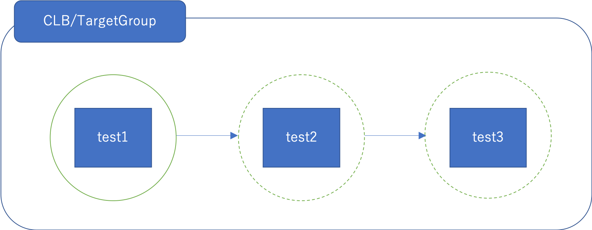

# corocoro
Execute something on AWS while controlling to deregister and register from ELB.

## Image



1. Deregister from CLB/TargetGroup
2. Execute something (such as restart instance)
3. Register to CLB/TargetGroup
4. Do step 1~3 for next instance

# Setup

## Install Packages

```
virtualenv venv
source venv/bin/activate
pip install -r requirements.txt
```

## Setup credentials

You must setup aws credential, which is default profile.

https://docs.aws.amazon.com/us_en/cli/latest/userguide/cli-configure-files.html


# How to use
## Restart instances

```
python corocoro.py restart i-XXXXXXXXXXX i-XXXXXXXXXXXXX i-XXXXXXXXXXXXX 
[INFO]TargetInstance: ['test1', 'test2', 'test3']
Confirm? (yes/no):
>>> yes
...
...
...
```

## Execute RuuCommand
Work in progress...

## Setting

- `DEREGISTER_TIMEOUT` : Timeout seconds to deregister from CLB/Targetgroup
- `REGISTER_TIMEOUT` : Timeout seconds to register to CLB/Targetgroup
- `SLOW_START_WAIT_TIME` : Waiting time as seconds after execution
- `RESTART_TIMEOUT` : Timeout seconds to restart instance
